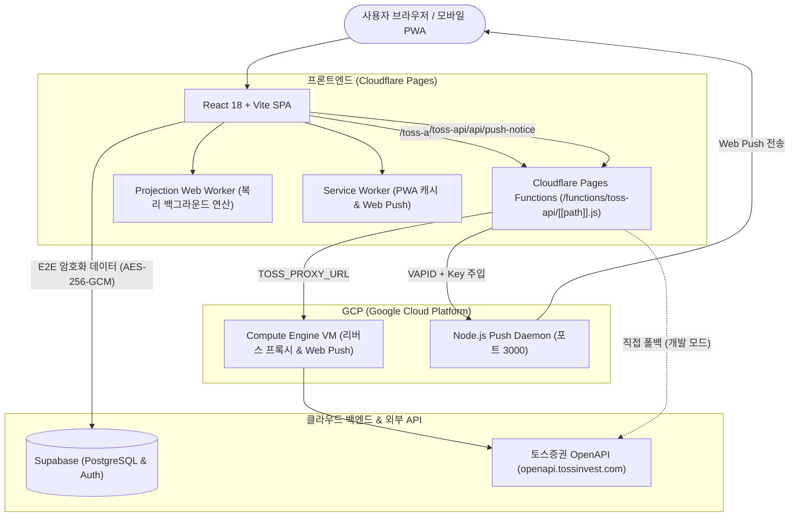

# 🚀 자산관리 대시보드 (Asset Management Dashboard)
> **개인 종합 자산관리, 파이어족 은퇴 시뮬레이션 & 게이미피케이션 대시보드**  
> **현재 버전**: `v2.3.5` | **배포 플랫폼**: `Cloudflare Pages` + `GCP (Google Cloud Platform)` | **데이터베이스**: `Supabase`

---

## 📌 목차 (Table of Contents)
1. [프로젝트 개요 (Overview)](#1-프로젝트-개요-overview)
2. [개발 및 CI/CD 배포 파이프라인 (DevOps Lifecycle)](#2-개발-및-cicd-배포-파이프라인-devops-lifecycle)
3. [전체 시스템 아키텍처 & 인프라 (Runtime Architecture)](#3-전체-시스템-아키텍처--인프라-runtime-architecture)
4. [토스증권 OpenAPI 연동 & 프록시 파이프라인](#4-토스증권-openapi-연동--프록시-파이프라인)
5. [핵심 기능 및 금융 연산 엔진 명세](#5-핵심-기능-및-금융-연산-엔진-명세)
6. [디렉터리 구조 및 파일별 역할 상세](#6-디렉터리-구조-및-파일별-역할-상세)
7. [스토리지 & 데이터 모델 명세 (Storage & Data Schema)](#7-스토리지--데이터-모델-명세-storage--data-schema)
8. [환경 변수 & 배포 가이드 (Deployment Guide)](#8-환경-변수--배포-가이드-deployment-guide)
9. [개발자 및 AI 에이전트를 위한 핵심 유지보수 원칙 (AI Guidelines)](#9-개발자-및-ai-에이전트를-위한-핵심-유지보수-원칙-ai-guidelines)

---

## 1. 프로젝트 개요 (Overview)

본 프로젝트는 개인의 모든 금융 자산(국내/해외 주식, 연금저축, IRP, 암호화폐, 금, 현금/예적금, 부동산 등)을 통합 관리하고, 파이어(FIRE)족을 위한 복리·인플레이션·지출 기반 은퇴 시뮬레이션을 제공하는 **고성능 반응형 단일 페이지 애플리케이션(SPA)**입니다.

단순한 가계부를 넘어, **"토이 프로젝트 본연의 인터랙티브한 재미(게이미피케이션, 감성 앰비언트 테마, 실시간 타격감)"**와 **"금융 공학 수준의 정밀한 자산 평가(환차손익 분리, 무결점 PDF 리포트, E2E 종단간 암호화)"**를 결합했습니다.

## 2. 개발 및 CI/CD 배포 파이프라인 (DevOps Lifecycle)

본 프로젝트는 **Antigravity AI 페어 프로그래밍**을 시작으로 **GitHub**을 거쳐 **Cloudflare Pages**로 이어지는 완전 자동화된 무중단 CI/CD 배포 파이프라인을 따릅니다.

```mermaid
flowchart LR
    Dev([👨‍💻 개발자]) <-->|페어 프로그래밍 / 자율 수정| AGY["🤖 Antigravity AI Agent<br/>(Gemini 3.8 Flash)"]
    
    subgraph Local ["로컬 개발 환경 (Local Machine)"]
        AGY --> LocalRun["로컬 HMR 검증<br/>(npm run dev / Vite :5173)"]
        LocalRun --> BuildCheck["빌드 무결성 사전 검증<br/>(npm run build)"]
        BuildCheck --> GitLocal["로컬 커밋<br/>(git commit -m ...)"]
    end

    subgraph GitHub ["GitHub 원격 저장소"]
        GitLocal -->|사용자 명시적 '푸시' 승인 시| GH_Repo["GitHub Repository<br/>(main 브랜치)"]
    end

    subgraph Cloudflare ["Cloudflare Pages (CI/CD)"]
        GH_Repo -->|GitHub Webhook 자동 트리거| CF_Build["Cloudflare 자동 빌드<br/>(Vite Production Build)"]
        CF_Build --> CF_Edge["글로벌 엣지 배포<br/>(Pages Functions + CDN)"]
    end

    subgraph Live ["실제 운영 서비스 (Production)"]
        CF_Edge --> Users([📱 엔드 유저 / PWA 사용자])
    end
```



### 배포 라이프사이클 핵심 4단계
1. **AI 페어 프로그래밍 & 검증 (Antigravity)**:
   * 로컬 워크스페이스에서 Antigravity 에이전트와 대화하며 코드 수정, 기능 구현, 디버깅 수행.
   * 개발 서버(`task-8013`, `:5173`)와 `npm run build`를 통해 **런타임 에러 0건을 사전 검증**.
2. **엄격한 로컬 커밋 분리 (Local Commit)**:
   * 사용자가 `"커밋"` 지시 시 로컬 Git에만 커밋(`git commit`)을 안전하게 기록하고, 임의로 원격에 올리지 않음.
3. **원격 푸시 (GitHub Push)**:
   * 사용자가 최종 검토 후 `"푸시"` 승인 시 GitHub `main` 브랜치(`GwonSun-Seong/Asset-Management`)로 전송.
4. **글로벌 무중단 자동 배포 (Cloudflare Pages)**:
   * GitHub `main` 브랜치 변경을 Cloudflare Pages가 감지하여 즉시 프로덕션 빌드 실행 ➔ 글로벌 엣지 네트워크로 자동 배포 완료.

---

## 3. 전체 시스템 아키텍처 & 인프라 (Runtime Architecture)

본 서비스는 클라이언트 중심(Client-heavy) 아키텍처로 설계되어 서버 비용을 극소화하면서도 뛰어난 보안성과 확장성을 유지합니다.



### 인프라 컴포넌트 상세
1. **Frontend**: React 18, Vite 5, Tailwind CSS, Chart.js 4 (PWA 및 데스크톱/모바일 완벽 반응형).
2. **CDN & 호스팅 (Cloudflare Pages)**: 글로벌 엣지 네트워크 배포, 서브마이크로초 캐싱, 자동 HTTPS.
3. **엣지 서버리스 프록시 (Cloudflare Pages Functions)**:
   - 경로: `functions/toss-api/[[path]].js`
   - 역할: 브라우저 CORS 회피, HTTP OPTIONS 프리플라이트 처리, 헤더 스푸핑 차단 방지 필터링.
   - **공지/푸시 인터셉트**: 브라우저에서 `/toss-api/api/push-notice` 호출 시 Cloudflare 환경변수에 은닉된 `VAPID_PRIVATE_KEY`와 `SUPABASE_KEY`를 자동 주입하여 GCP VM으로 안전하게 중계.
4. **GCP VM 인스턴스 (Compute Engine - 리버스 프록시 & Web Push 발송 서버)**:
   - **구동 구조 및 포트 명세**:
     - **포트 80**: 토스증권 OpenAPI 트래픽 중계 리버스 프록시 (`/home/proxy.js`). Akamai TLS SNI 검증 통과 및 CORS 프리플라이트 자동 처리.
     - **포트 3000**: **Node.js Web Push Daemon** (`~/push-server/push-server/server.js`, PM2 무중단 상시 데몬 구동).
     - **상태 점검 엔드포인트**: `GET /health` (`{"status":"healthy",...}`)를 통한 헬스체크 지원.
   - **양방향 웹 푸시 라우팅 파이프라인 (2-Way Web Push Routing)**:
     - ① **전체 공지 발송 (`target: 'all'`)**: 관리자 대시보드에서 공지 등록 시 `users_push_tokens`의 모든 활성 구독자에게 일괄 브로드캐스트.
     - ② **사용자 의견 접수 시 관리자 전용 알림 (`target: 'admin'`)**: 일반 사용자가 의견을 등록하면 `user_profiles`에서 `is_admin = true`인 계정의 등록 디바이스로만 핀포인트 전송.
   - **멀티 디바이스 안전 토큰 정리 (Multi-Device Safe Cleanup)**:
     - 410 Gone / 404 Not Found 에러 발생 시 기존의 `user_id` 기준 일괄 삭제를 탈피하고, 만료된 특정 기기의 `endpoint`만 선택적으로 자동 정리하여 사용자의 타 디바이스(스마트폰, PC 등) 토큰을 안전하게 보존.
5. **Database / BaaS (Supabase)**:
   - PostgreSQL 기반 사용자 자산 스냅샷 동기화, RLS(Row Level Security) 접근 제어.
   - `users_push_tokens` 테이블을 통해 멀티 디바이스 푸시 수신 기기 토큰 관리 (`user_id`, `endpoint`, `subscription`, `push_consent`).
   - `user_profiles` 테이블을 통해 관리자 여부(`is_admin`), 프로 라이선스(`is_pro`), 의견함(`suggestions`) 및 답변 관리.
   - 클라이언트 측 **AES-256-GCM 종단간 암호화(E2EE)**를 적용하여 서버 관리자도 원본 금융 데이터를 열람할 수 없음.

---

## 3. 토스증권 OpenAPI 연동 & 프록시 파이프라인

### 1) 인증 및 수명 주기 관리
* **자격 증명 보관**: `localStorage`의 `toss_client_id` 및 `toss_client_secret`.
* **OAuth 2.0 토큰 발급 (`getTossToken`)**:
  * 엔드포인트: `/oauth2/token`
  * 만료 시간을 감지하여 토큰을 캐싱하며, 호출 도중 `401 Unauthorized` 발생 시 **토큰을 강제 즉시 갱신한 후 실패한 요청을 자동 재시도(Self-Healing Auto-Refresh)**.

### 2) 사용 엔드포인트 및 처리 전략
| 엔드포인트 | 목적 | 처리 전략 및 자가 치유(Self-Healing) |
| :--- | :--- | :--- |
| `/api/v1/prices?symbols=...` | 실시간 주가/전종가 | • 8개 단위 청크(Chunk) 분할 호출<br>• 미등록 티커로 인한 400 실패 시 **단건(`fetchSingleTossQuote`) 자동 분해 재시도**<br>• 한글명/공백 자동 필터링 |
| `/api/v1/exchange-rate` | 실시간 USD/KRW 환율 | • 미국 주식 원화 환산 기준가<br>• 직전 환율(`asset_prev_usd_krw`)과 실시간 환율을 동시 저장하여 **환차익/환차손 분리 추적** |
| `/api/v1/candles` | 일봉 캔들 히스토리 | • 일봉 기반 추세 분석 및 전일 종가 정밀 교차 검증 |
| `/api/v1/market-calendar/*` | 한/미 마켓 캘린더 | • 개장/휴장일 상태 감지 및 휴일 안내 |

---

## 4. 핵심 기능 및 금융 연산 엔진 명세

### 1) 오늘의 투자 성과 (전일 마감 대비)
* **장마감·휴일 무관 전종가 1:1 보존 계산**:
  * 토스 API가 주간 또는 장외 시간에 `change: 0`을 반환하더라도, 기존에 저장된 전종가(`basePrice`/`prevClose`)를 덮어쓰지 않고 엄격히 보존.
  * `현재가 - 전종가`를 직접 계산하여 주말/야간에도 실제 당일 손익을 영구 표시.
* **미국 주식 환차손익 동시 산출 공식**:
  $$\text{당일 순손익(KRW)} = (\text{USD 현재가} \times \text{현재 환율} \times \text{수량}) - (\text{USD 전종가} \times \text{전일 환율} \times \text{수량})$$
  - 주가 상승분과 달러 환율 변동분이 1원 단위까지 합산되어 실제 계좌 순자산 변동과 일치.
* **수익률 2중 분리 표기**:
  - `투자자산 성과`: 현금/예금을 제외한 순수 투자자산만의 변동률(%)
  - `총자산 대비`: 전체 순자산 기준 변동률(%)
* **0x0 Safe Fallback**: 기준가/현재가가 0 또는 결측치일 때 `+99,999%`로 튀는 연산 왜곡 원천 차단.

### 2) [PRO] 실시간 손익 날씨 앰비언트 엔진 (`src/components/WeatherAtmosphere.jsx`)
* **개요**: 당일 손익률(`dayProfitPct`)에 따라 대시보드 좌우 거터(Gutter) 여백에 반응형 날씨 앰비언트 파티클을 렌더링하는 실시간 캔버스 엔진.
* **손익별 앰비언트 상태 머신**:
  * `+1.5% 이상`: ☀️ **맑음 (대폭등)** - 유기적인 황금빛 아지랑이 & 다이아몬드 프리즘 별빛 파티클
  * `0% ~ +1.5%`: 🌤️ **화창한 상승** - 에메랄드 스프링 앰비언트 & 부드러운 빛무리
  * `-1.5% ~ 0%`: 🌧️ **부슬부슬 비** - 유기적인 빗방울 낙하 및 바닥 스플래시 물보라
  * `-1.5% 미만`: ⚡ **천둥 번개 폭풍우** - 거센 빗줄기와 단일 사이드 천둥번개
* **0 ~ 100% 아날로그 강도 조절 슬라이더**:
  * 설정 모달에서 0(OFF)부터 100(최대)까지 정밀 조절 가능 (25%, 50%, 75%, 100% 원클릭 프리셋 지원).
* **0.85초 지속 천둥번개 3단계 물리 연출**:
  * **하향 전개 (0 ~ 0.16초)**: 구름에서부터 아래로 찌지직 내리꽂히며 뻗어나가는 경로 전개.
  * **주방전 & 지직거리는 리플 (0.16 ~ 0.44초)**: 화면에 묵직하게 머무르며 미세하게 진동하는 방전 효과 및 네온 글로우 지속.
  * **잔여 이온 서서히 소멸 (0.44 ~ 0.85초)**: 곁가지가 먼저 식고 메인 줄기가 부드러운 감쇄 곡선으로 페이드아웃.
  * **배경 플래시 100% 배제**: 화면 색을 강제로 번쩍이는 배경 플래시 없이 오직 번개선과 글로우만으로 정갈한 무드 유지.
  * **좌/우 비대칭 단일 사이드 번개**: 좌우 동시 번개 발생을 원천 차단하여 시각적 피로도 최소화 (intensity 50 기준 약 30초 주기).

### 3) 반응형 앱 설정 모달 & 로컬 관리자 모드 (`src/modals.jsx`, `src/App.jsx`)
* **데스크톱 2열 그리드 레이아웃**: PC 화면(`md:max-w-3xl lg:max-w-4xl`)에서 2열 그리드 카드로 시원하게 배치되며, 날씨 강도 슬라이더는 전체 너비로 쾌적한 조작 지원.
* **모바일 최적화**: 4개 탭(`🎨 화면·효과`, `🔔 알림·데이터`, `🔐 보안·계정`, `전체 보기`)과 터치 스크롤 100% 지원.
* **로컬 개발자 관리자 토글**: 로컬 환경(`localhost`)에서 앱 헤더의 `[LOCAL]` 배지를 클릭하여 즉시 관리자 권한(`[LOCAL: ADMIN 👑]`)으로 전환 가능. (디스플레이 모드 4단 순환: `일반 -> 프라이빗 -> 데모 -> 관리자 -> 일반`)

### 3) 초고속 미래 자산 추계 엔진 (Web Worker)
* 메인 UI 스레드 프리징을 방지하기 위해 `src/projection.worker.js`에서 백그라운드로 복리, 물가상승률, 월 지출, 은퇴 후 현금흐름 시뮬레이션을 수 밀리초 만에 연산.
* 타임라인 차트에 **Live Scrubbing HUD**, **Glowing Tracer Dot**, **Wave Animation** 탑재.

### 4) 무결점 A4 다중 페이지 PDF 내보내기 엔진 (`src/utils.js`)
* 브라우저 `window.print()` 단순 출력이 아닌, 전체 패널 순차 확장 ➔ 입력창 평탄화 ➔ A4 높이 비율 계산에 따른 `.pdf-page-spacer` 자동 삽입 ➔ `html2canvas` (1.2배율) ➔ `jsPDF` 페이지 분할.
* **createPattern 0x0 브라우저 크래시 가드**:
  * 숨겨진 캔버스나 0-width SVG 패턴 로딩 시 `CanvasRenderingContext2D.prototype.createPattern`을 인터셉트하여 1x1 투명 캔버스로 안전 폴백(Fallback).

---

## 5. 디렉터리 구조 및 파일별 역할 상세

```
AssetManagement/
├── .github/                      # GitHub Actions CI/CD 워크플로우
├── functions/                    # Cloudflare Pages Functions (Edge Serverless)
│   └── toss-api/
│       └── [[path]].js           # CORS 우회, 토스 API 프록시, GCP VM 푸시 중계 함수
├── public/                       # 정적 에셋
│   ├── manifest.json             # PWA 매니페스트
│   └── sw.js                     # PWA Service Worker (오프라인 캐싱 & 웹 푸시 이벤트)
├── src/
│   ├── components/               # 모듈화된 서브 컴포넌트
│   │   ├── AssetSummaryCard.jsx  # 상단 순자산/총자산/부채 요약 카드
│   │   ├── MarketTickerSlide.jsx # 메인 상단 실시간 티커 슬라이더 바
│   │   ├── ScenarioComponents.jsx# 시나리오 비교 서브 컴포넌트
│   │   └── WeatherAtmosphere.jsx # [신규] 실시간 손익 날씨 앰비언트 & 3단계 천둥번개 물리 엔진
│   ├── App.jsx                   # 메인 대시보드 코어 (상태 머신, 실시간 폴링, 패널 관리)
│   ├── config.js                 # API 엔드포인트 및 기본 앱 설정
│   ├── defaultData.js            # 신규 사용자용 초기 자산/지출 템플릿 데이터
│   ├── game.jsx                  # 노후 자금 가챠 및 게이미피케이션 미니 모듈
│   ├── main.jsx                  # React 진입점 및 PWA 서비스워커 등록
│   ├── modals.jsx                # 통합 설정 모달, API키 설정, 자산 입력 모달
│   ├── projection.worker.js      # 미래 자산 복리 계산 웹 워커 스크립트
│   └── utils.js                  # 토스 API 통신, 환율 계산, 포맷터, PDF 내보내기 유틸
├── index.html                    # 메인 HTML 셸 & CDN 스크립트 로더
├── package.json                  # 프로젝트 메타데이터, 스크립트, 의존성 (v2.3.5)
├── toss_api_doc.txt              # 토스증권 OpenAPI 공식 규격 및 스펙 문서
└── vite.config.js                # Vite 번들러 설정 & 로컬 /toss-api 리버스 프록시
```

---

## 6. 스토리지 & 데이터 모델 명세 (Storage & Data Schema)

### 1) 브라우저 `localStorage` 키 레퍼런스
| 키 이름 | 데이터 타입 | 설명 |
| :--- | :--- | :--- |
| `assetDashboardDataV3` | JSON String | 현재 사용자의 전체 자산, 지출, 이벤트 마스터 데이터 |
| `assetHistory` | Array JSON | 일별 순자산/총자산 스냅샷 히스토리 타임라인 |
| `toss_client_id` / `secret` | String | 사용자 토스증권 OpenAPI 자격 증명 |
| `toss_token_cache` | JSON String | 발급된 토스 Access Token 및 만료 시간 타임스탬프 |
| `asset_last_usd_krw` | Number String| 가장 최근 수신된 실시간 원/달러 환율 |
| `asset_prev_usd_krw` | Number String| 직전 기준 환율 (환차손익 계산용) |
| `asset_weather_effect_enabled`| Boolean String| [PRO] 실시간 손익 날씨 효과 활성화 여부 (기본: `false`) |
| `asset_weather_effect_intensity`| Number String | [PRO] 날씨 앰비언트 파티클 및 번개 강도 (0 ~ 100, 기본: `70`) |
| `toss_live_price_enabled` | Boolean String| 실시간 주가 백그라운드 폴링 활성화 여부 |
| `toss_live_price_interval`| Number String | 실시간 폴링 주기 (초 단위, 기본: 60) |

### 2) Supabase 테이블 스키마
* `users_dashboard_data`: 사용자별 암호화된 자산 JSON(`ciphertext`), 솔트, IV 저장.
* `users_push_tokens`: PWA Web Push 구독 엔드포인트, 키(`p256dh`, `auth`), 디바이스 정보.
* `user_profiles`: 사용자 라이선스 상태(`is_pro`), 데이터 수집 동의 여부.

---

## 7. 환경 변수 & 배포 가이드 (Deployment Guide)

### 1) 환경 변수 설정
* **Vite / Client (`.env` 또는 시스템 환경변수)**:
  * `SUPABASE_URL`: Supabase 프로젝트 URL
  * `SUPABASE_KEY`: Supabase 익명(anon) 공개 키
  * `SECURITY_KEY`: 기본 데이터 무결성 검증 키
* **Cloudflare Pages 환경 변수**:
  * `TOSS_PROXY_URL`: GCP VM 인스턴스 프록시 엔드포인트 (예: `http://<GCP_VM_IP>:포트`)
  * `VAPID_PUBLIC_KEY` / `VAPID_PRIVATE_KEY`: Web Push 발송용 비대칭 암호화 키

### 2) 빌드 및 실행 명령어
```bash
# 패키지 설치
npm install

# 로컬 개발 서버 실행 (Vite 프록시 탑재)
npm run dev

# 프로덕션 번들 빌드
npm run build

# 프로덕션 빌드 미리보기
npm run preview
```

---

## 8. 개발자 및 AI 에이전트를 위한 핵심 유지보수 원칙 (AI Guidelines)

> [!IMPORTANT]
> **본 저장소에서 작업하는 모든 AI 에이전트 및 기여자는 아래의 절대 규칙을 엄격히 준수해야 합니다.**

1. **Git Commit & Push 분리 원칙**:
   * 사용자가 `"커밋"`만 지시한 경우 절대로 `git push`를 실행하지 마십시오. (로컬 커밋만 수행)
   * 사용자가 명시적으로 `"푸시"` 또는 `"커밋앤푸시"`라고 명령했을 때만 `git push origin main`을 실행합니다.
2. **모놀리식 코어 파일(`src/App.jsx`) 수정 시 외과수술식 접근**:
   * `App.jsx`는 9,500라인 이상의 대형 컴포넌트입니다. 전체 파일을 덮어쓰거나 무리하게 리팩터링하지 말고, 대상 함수/블록만 정밀 타깃팅하여 기존 훅과 상태 트리의 연결을 절대 깨뜨리지 마십시오.
3. **토스 API 프록시 구조 존중**:
   * 클라이언트 코드에서 토스 API를 직접 `https://openapi.tossinvest.com`으로 쏘는 코드로 되돌리지 마십시오. 로컬은 `/toss-api`, 배포는 Cloudflare Functions ➔ GCP VM 프록시 파이프라인을 반드시 경유해야 합니다.
4. **금융 계산 공식 임의 단순화 금지**:
   * 오늘의 투자 성과는 장마감 여부와 무관하게 **전일 종가 대비 현재가**를 기준으로 해야 하며, 미국 주식은 **환율 변동분(환차익)**이 반드시 합산되어야 합니다.
5. **PDF 내보내기 엔진 다운그레이드 금지**:
   * multi-panel 전체 순차 렌더링, spacer 여백 분할, createPattern 0x0 캔버스 인터셉트 가드를 절대 제거하거나 단순 `window.print()`로 강등하지 마십시오.

---
*최종 문서 작성일: 2026-09-04 | 버전: v2.3.5 | 메인테이너: GwonSun-Seong*
